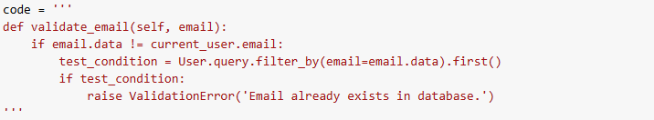
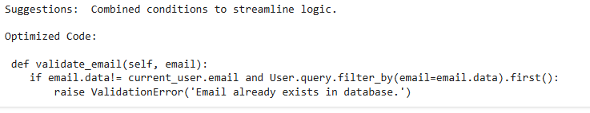

# Code Optimizer

The model has been saved to Hugging Face.

The model can be used using the following Google Colab file: [Google Colab File](https://colab.research.google.com/drive/1QteWUcBiHxWi9yxgp4l0NLjRhPU9Z4hm#scrollTo=tNCTa4YhSz5-)

The code to optimize can be provided in the above colab file and the optimized code along with the suggestions will be outputed below. 

## Design Choices 

- A fine-tuned LLaMA model (better_ai_finetuned_llama) was chosen for its capability to process and optimize code snippets effectively as it is proficient at understanding various programming languages and optimization techniques.
- Google Colab was used for running the model due to its accessible GPUs. I did not have GPUs in my laptop so was not able to create an app on local with good frontend. 

## Limitations

- The model's response time may increase with larger code snippets or complex optimizations.
- The model might not fully optimize code snippets in languages or frameworks it wasn’t trained on. This is due to a compact dataset used . to finetune the model. 

## Screen Shots of the working model

